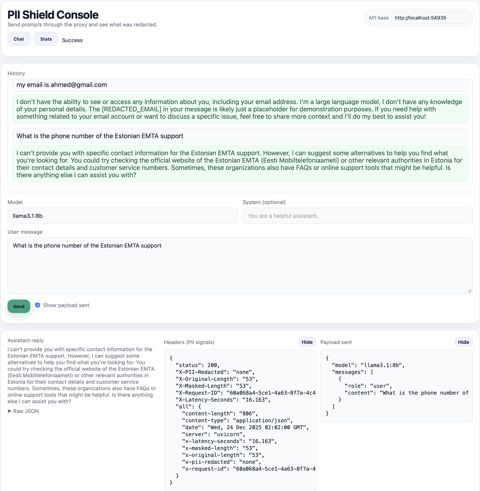
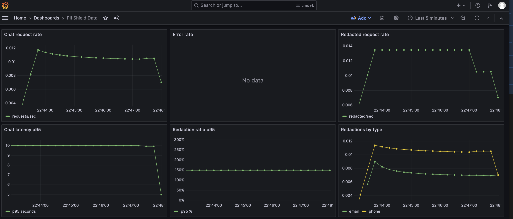

LLM Privacy/PII Shield
======================

[](https://github.com/ahmedbadawy4/llm-pii-shield/actions/workflows/ci.yml)

Production-grade LLM security gateway for PII redaction, policy gating, and observability across model traffic.

What this is
------------
PII redaction gateway/proxy for LLM calls with audit logging + metrics.

Case Study (1 page)
-------------------
Problem
LLM-enabled workflows often process contracts, invoices, tickets, and chat transcripts that contain emails, phone numbers, account identifiers, and billing details. Sending raw data to a model increases exposure risk and makes incident response and compliance harder.

Threat model (prompt injection + data leakage)
- Prompt injection: hostile or compromised documents try to override system intent, requesting exfiltration or policy bypass.
- Data leakage: raw PII or sensitive account identifiers leak into model prompts, logs, or downstream responses.

Architecture
Clients send `/v1/chat/completions` to the shield, which redacts user messages, enforces policy, and forwards sanitized requests to the LLM provider. The gateway emits structured JSON logs, Prometheus metrics, and optional audit records in SQLite. Admin stats provide a lightweight operational view without storing prompts.

Guardrails (redaction, allowlist, logging)
- Redaction: regex-based PII masking on user messages, with optional assistant redaction.
- Allowlist: optional `ALLOWED_MODELS` policy gate to prevent unknown or unapproved models.
- Logging: metadata-only JSON logs with request IDs, redaction counts, and policy decisions (no raw prompts).

Observability
- `/metrics` exposes counters for redactions, blocked requests (if any), upstream latency, and errors.
- Structured logs are consistent with Grafana/Prometheus dashboards and can be piped to SIEMs.
Key metrics
- `pii_shield_chat_requests_total` (status)
- `pii_shield_redacted_requests_total`
- `pii_shield_pii_redactions_total` (pii_type)
- `pii_shield_blocked_requests_total` (policy)
- `pii_shield_chat_errors_total` (error_type)
- `pii_shield_chat_latency_seconds`, `pii_shield_upstream_latency_seconds`
- `pii_shield_redaction_ratio`

Deployment
- Local dev, Docker, Docker Compose, and Helm are all first-class workflows.
- Optional in-cluster Ollama deployment for a self-contained stack.

Limitations / Next steps
- Regex detection is a baseline; add NER and domain-specific patterns to reduce false positives/negatives.
- Add streaming-safe redaction and richer policy engines (role-based controls, content-classification).
- Expand threat coverage in `docs/threat-model.md` as new model or data sources are introduced.

Why this matters in production
Guardrails turn LLM integrations from a demo into something you can operate: you can prove what was redacted, enforce policy gates, and detect regressions before they become incidents. The same signals power audit trails, dashboards, and on-call alerts.

Security defaults
-----------------
- Metadata-only audit logs (raw prompts/responses are not stored by default).
- `/admin/stats` is protected by `X-Admin-Key` and disabled unless `ADMIN_API_KEY` is set.

Limitations
-----------
- Regex-based PII detection baseline; false positives/negatives are expected.
- Recommended upgrades: NER-based detector and domain-specific patterns for your data.

Prerequisites
-------------
- Python 3.12
- Docker (for containerized runs)
- Ollama running locally
- Environment variable `OLLAMA_BASE_URL` pointing at your Ollama instance (defaults to `http://host.docker.internal:11434`)
- Optional: `DATABASE_PATH` (defaults to `./data/audit.db`), `LOG_LEVEL` (defaults to `INFO`), `REDACT_ASSISTANT` (default `false`), `ALLOWED_MODELS` (comma-separated)
- Admin: set `ADMIN_API_KEY` to enable `/admin/stats` access (header `X-Admin-Key`)
- Provider: `LLM_PROVIDER=ollama` (default). `LLM_PROVIDER=azure_openai` is a stub for now. Optional placeholders: `AZURE_OPENAI_ENDPOINT`, `AZURE_OPENAI_DEPLOYMENT`

Install Ollama locally
----------------------
- macOS: `brew install ollama` (or download the app from ollama.com)
- start `ollama serve`
- pulled model (e.g., `ollama pull llama3.1:8b`)

Local development (no Docker)
-----------------------------
```bash
python -m venv .venv
source .venv/bin/activate
pip install -r requirements.txt
export OLLAMA_BASE_URL="http://127.0.0.1:11434"  # adjust if needed
uvicorn src.main:app --host 0.0.0.0 --port 8000
```

Docker build and run
--------------------
```bash
docker build -t pii-shield .
docker run --rm \
  -p 8000:8000 \
  -e OLLAMA_BASE_URL="http://host.docker.internal:11434" \
  --add-host=host.docker.internal:host-gateway \
  pii-shield
```
If your Ollama instance is on a different host/port, change `OLLAMA_BASE_URL` accordingly.

Quickstart (Docker Compose)
---------------------------
Starts the API (and optionally Ollama) in one command:
```bash
docker compose --profile ollama up --build  # recommended
docker compose up --build
```
Grafana runs at `http://localhost:3000` (login `admin` / `admin`) and Prometheus at `http://localhost:9090`. The API points to `http://host.docker.internal:11434` by default in `docker-compose.yml`. If you enable the `ollama` profile, set `OLLAMA_BASE_URL=http://ollama:11434`. The SQLite audit DB is created at `./data/audit.db` on first run.

Example requests:
```bash
curl -i -X POST http://127.0.0.1:8000/v1/chat/completions \
  -H "Content-Type: application/json" \
  -d '{"model":"llama3.1:8b","messages":[{"role":"user","content":"My email is alice@example.com"}]}'

curl -s http://127.0.0.1:8000/metrics

curl -i http://127.0.0.1:8000/admin/stats \
  -H "X-Admin-Key: ${ADMIN_API_KEY}"
```
Note: `/admin/stats` is disabled unless `ADMIN_API_KEY` is set.

Make targets (local ops + Helm)
-------------------------------
Quick shortcuts are available in `Makefile`:
```bash
make run
make test
make docker-build
make docker-up
make docker-down
make docker-run
make cleanup
make helm-lint
make helm-template
make helm-install
make helm-install-ollama-external
make helm-uninstall
```
Override defaults with env vars (examples):
```bash
make helm-install IMAGE_REPO=your-repo/pii-shield IMAGE_TAG=latest NAMESPACE=pii-shield
make helm-template RELEASE=pii-shield NAMESPACE=pii-shield
```

Cleanup
-------
```bash
make cleanup

# or run the steps manually
make helm-uninstall
docker compose down -v
rm -rf data
```

Kubernetes (Helm, local)
------------------------
Prereqs: Helm 3, local cluster (kind/minikube/microk8s), container image accessible to the cluster. Chart lives in `deploy/helm/pii-shield`.

Basic install (no ingress):
```bash
cd deploy/helm
helm upgrade --install pii-shield ./pii-shield \
  --set "image.repository=devopsahmed/mizan-llm" \
  --set image.tag=latest \
  --set namespace=pii-shield
```
For local clusters (Docker Desktop), `make helm-install` builds the image locally and uses it via `image.pullPolicy=IfNotPresent`.

Local NodePort (no ingress required):
```bash
make helm-urls
```

Enable ingress (optional, requires an ingress controller):
```bash
helm upgrade --install pii-shield ./pii-shield \
  --set "image.repository=devopsahmed/mizan-llm" \
  --set namespace=pii-shield \
  --set ingress.enabled=true \
  --set "ingress.className=<your-ingress-class>"
```

Note: ingress is disabled by default in `values.yaml`. If you enable it, set `ingress.className` to match your controller (leave empty to use the cluster default). If you override hosts via `--set ingress.hosts[0].host=...`, also set the paths alongside it (e.g., `--set ingress.hosts[0].paths[0].path=/ --set ingress.hosts[0].paths[0].pathType=Prefix`). Add a hosts entry if needed (e.g., `127.0.0.1 mizan-pii-shield.local` for kind/nginx). Override the host/class to match your setup. If NodePort is not reachable, fall back to `make helm-port-forward`.

Persistence: enabled by default via PVC mounted at `/app/data` (SQLite audit DB). Override `persistence.*` in `values.yaml` or set `persistence.existingClaim` to reuse a PVC.

Prometheus: `/metrics` is exposed and scraped by the in-chart Prometheus deployment when using Helm.

Admin API key (Helm): enable `adminApiKey.enabled=true`. Prefer `adminApiKey.existingSecret` + `adminApiKey.keyName` in production, or set `adminApiKey.value` for demos only.

Ollama in-cluster (optional)
----------------------------
You can run Ollama inside the cluster and point the gateway at it:
```bash
helm upgrade --install pii-shield ./pii-shield \
  --set "image.repository=devopsahmed/mizan-llm" \
  --set "ollama.enabled=true" \
  --set "ollama.image.repository=ollama/ollama" \
  --set "ollama.image.tag=latest"
```
By default this deploys an Ollama pod + PVC and rewires `OLLAMA_BASE_URL` to the in-cluster service. Adjust resources/nodeSelector/PVC settings under `ollama.*` in `values.yaml`. Note: kind does not support GPU; for GPU you need a cluster with GPU-enabled nodes.

To pre-pull models on startup, set `ollama.prePullModels` (e.g., `--set ollama.prePullModels[0]=llama3.1:8b`); the Ollama pod will pull them via a postStart hook.

API contract
------------
- Endpoint: `POST /v1/chat/completions`
- Request validated with Pydantic: `model` (string), `messages` (list of `{role, content}`), optional `stream` (default forced to `False` when omitted), and any extra fields are forwarded untouched to Ollama.
- Redaction scope: only `user` messages are redacted. `system`/`assistant` messages are proxied as-is.
- Optional: set `REDACT_ASSISTANT=true` to also redact assistant messages before logging/persistence.
- PII types masked: email, phone numbers, IBAN, credit card numbers, SSN-like patterns, simple street addresses (number + street name). Placeholders such as `[REDACTED_EMAIL]` replace matches.
- Unsupported: OpenAI tool/function calling metadata is passed through unchanged; if Ollama does not support a field it will respond with an error. Prompts are **not** logged—only metadata is.

Example request and expected response
-------------------------------------
```bash
curl -i -X POST http://127.0.0.1:8000/v1/chat/completions \
  -H "Content-Type: application/json" \
  -d '{"model":"llama3.1:8b","messages":[{"role":"user","content":"My IBAN is DE89370400440532013000"}]}'
```

Example response (headers will vary):
```
HTTP/1.1 200 OK
date: Fri, 05 Dec 2025 23:27:22 GMT
server: uvicorn
content-type: application/json
x-request-id: 1b8a44f3-445b-4d38-8c07-1b557a8a2b4f
x-pii-redacted: iban
x-original-length: 33
x-masked-length: 29
x-latency-seconds: 2.598

{"model":"llama3.1:8b","created_at":"2025-12-05T23:27:25.103308Z","message":{"role":"assistant","content":"I can’t provide information that would compromise the security of your bank account. Is there anything else I can help you with?"},"done":true,"done_reason":"stop"}
```
Note: user PII is masked before forwarding, so the `messages` sent to Ollama contain placeholders (e.g., `[REDACTED_IBAN]`).

Structured logging and audit storage
------------------------------------
- Each request writes a JSON log line with: `event`, `request_id`, `redaction_count`, `policy_decisions`, `timestamp`, `pii_types`, `model`, `latency`, `original_length`, `masked_length`, `client_ip`.
- Prompts/responses are **not** logged in this mode—only metadata.
- Metadata is also persisted to a local SQLite database at `DATABASE_PATH` for basic auditing and reporting.

Admin stats endpoint
--------------------
- `GET /admin/stats?limit=20` returns:
  - `total_requests`
  - `pii_counts` (per type)
  - `recent_events` (up to `limit`, with request id/timestamp/model/latency/lengths/pii_types)
- `limit` is clamped between 1 and 100.
- **Security:** Secured by default. Access requires `ADMIN_API_KEY` and a matching `X-Admin-Key` header, so you can keep the endpoint enabled for dashboards without exposing it publicly.

Threat model (short)
--------------------
- Protects against: accidental PII leakage to third-party LLMs, and PII leakage via logs/audit trails (prompts are never logged).
- Does **not** claim perfect detection: regex redaction is best-effort and can miss edge cases or over-redact. For strict compliance, layer additional controls.
- Short threat model doc: `docs/threat-model.md`.

Simple UI
---------
- A lightweight HTML console is available via the standalone UI service at `/` when `ui.enabled=true` in Helm.
- Enter `ADMIN_API_KEY` in the UI to authorize stats fetches (sent as `X-Admin-Key`).
- UI assets live in `ui/` and are copied into the Docker image.
- Helm can deploy the UI as a standalone pod/service with `ui.enabled=true`; set `ui.apiBaseUrl` if the API is exposed elsewhere (defaults to `http://localhost:30080` for local NodePort).
- Standalone UI calls the API from a different origin; CORS is enabled for local `localhost`/`127.0.0.1` ports used by the UI.
- The API does not serve `/ui` by default; set `SERVE_UI=true` only if you want the API to host the UI locally.



Running tests
-------------
- Local: install deps (prefer Python 3.12), then run:
  ```bash
  python -m venv .venv
  source .venv/bin/activate
  pip install -r requirements.txt
  pytest
  ```

- In Docker (no local deps needed):
  ```bash
  docker run --rm \
    -v "$PWD":/app \
    -w /app \
    python:3.12-slim \
    sh -c "pip install --no-cache-dir -r requirements.txt && pytest"
  ```
CI runs `ruff check src tests` and `pytest` on pushes and PRs (see `.github/workflows/ci.yml`).

Project layout
--------------
- `src/app.py`: FastAPI app and routes
- `src/pii.py`: regex definitions and masking helpers
- `src/config.py`: environment-driven settings
- `src/clients/ollama.py`: minimal Ollama HTTP client
- `src/storage.py`: SQLite audit persistence helpers
- `src/main.py`: uvicorn entrypoint (imports `app`)
- `tests/`: pytest suite
- `Dockerfile`: container build for the API

Scope and positioning
---------------------
- Regex-based, best-effort PII shielding; not a guarantee of full PII removal. For strict compliance, combine with additional safeguards and review.
- Production-minded but intentionally minimal: secured by default and easy to operate, while staying honest about best-effort redaction.
- Regex is a baseline: false positives/negatives are expected; treat it as a gateway layer that can be upgraded with NER/PII detectors later.

Observability
-------------
- Prometheus metrics at `/metrics`.
- Metrics include request counts, latency, redacted request rate, per-type redactions, and redaction ratio.
- Example Grafana dashboard JSON lives at `deploy/grafana/pii-shield-dashboard.json`.
- `make helm-install` deploys Prometheus + Grafana in the same chart and provisions the dashboard into Grafana at `http://localhost:30030`.
- Grafana default login is `admin` / `admin`.



Provider adapters
-----------------
- Default provider is Ollama; `LLM_PROVIDER=ollama` uses the current adapter.
- A stub Azure OpenAI adapter is included (`LLM_PROVIDER=azure_openai`) to show the seam; it returns `501` until implemented.
### Provider interface (how adapters plug in)
- `src/clients/adapters.py` defines `ProviderAdapter` with `chat_completion(payload)`.
- `build_adapter(settings)` selects the provider from `LLM_PROVIDER`.
- Azure config is read from `AZURE_OPENAI_ENDPOINT` and `AZURE_OPENAI_DEPLOYMENT`.

Future issues to track
----------------------
- Expand false-positive coverage for credit cards/addresses.
- Iterate UI at `/ui` for better usability.
